# AURESTA — System Architecture

## 1. Business Problem and Target Users

### Business Problem

Planning an event usually requires users to coordinate multiple independent vendors and services.

For a single event, a customer may need to find:

* Venues
* Decorators
* Caterers
* Photographers
* Videographers
* DJs and entertainment providers
* Makeup artists
* Cakes and desserts
* Event planners
* Other specialized services

Managing these services manually can result in:

* Difficulty discovering reliable vendors.
* Time-consuming comparison of prices and services.
* Limited visibility into vendor availability.
* Difficulty coordinating multiple vendors.
* Uncertainty regarding vendor quality and verification.
* Complicated event budgeting.
* Last-minute vendor requirements.
* Fragmented communication between customers and service providers.
* Difficulty managing bookings and payments.
* No centralized view of an entire event.

Auresta is designed as an all-in-one event discovery, planning, vendor marketplace, package-building, booking, and event-management platform.

The platform allows customers to discover verified event vendors, compare services and pricing, check availability, build event packages, make bookings, manage event details, and receive support.

The platform also provides dedicated views for vendors and administrators.

### Target Users

The primary target users are:

#### 1. Event Customers

Customers planning events such as:

* Weddings
* Birthday parties
* Engagements
* Anniversaries
* Corporate events
* Baby showers
* Kids' parties
* Bachelorette events
* Private celebrations

Customers can:

* Enter event requirements.
* Discover vendors.
* Compare vendor profiles.
* Check availability.
* Build packages.
* Book services.
* Make payments.
* Manage event details.
* Communicate with vendors.
* Contact support.

#### 2. Event Vendors

Event service providers can use Auresta to manage their marketplace presence.

Examples include:

* Decorators
* Caterers
* Photographers
* Videographers
* DJs
* Entertainment providers
* Venues
* Makeup artists
* Bakeries
* Event planners

Vendors can:

* Manage their profile.
* Manage service packages.
* Manage availability.
* View bookings.
* Track revenue.
* Monitor ratings.
* Submit verification requests.

#### 3. Auresta Administrators

Administrators manage the overall marketplace.

Administrators can:

* Review vendor verification requests.
* Approve or reject vendors.
* Monitor platform activity.
* Track bookings.
* Monitor GMV.
* Track platform commissions.
* Manage marketplace quality.

---

# 2. Technology Stack

## Current Implementation

Auresta is currently implemented as a client-side web application.

The repository contains:

* HTML
* CSS
* Vanilla JavaScript
* Browser Local Storage
* Static demo data

The application does not currently include a dedicated backend server.

### Frontend

The current frontend stack includes:

* HTML5
* CSS3
* Vanilla JavaScript
* DOM rendering
* Browser Local Storage
* Responsive web UI

The application uses a single HTML entry point.

```text
index.html
```

The HTML document contains a single application container:

```html
<div id="app"></div>
```

JavaScript renders the application dynamically into this container.

The application also loads:

* Google Fonts
* Lucide Icons
* Canvas Confetti

### Application Structure

The core application is divided into:

```text
Auresta
│
├── index.html
│
├── css/
│   └── styles.css
│
└── js/
    ├── data.js
    ├── state.js
    └── app.js
```

### Data Layer

The current application uses static JavaScript datasets.

The demo data includes:

* Event categories
* Service categories
* Previous events
* Vendor information
* Vendor portfolios
* Vendor packages
* Vendor availability
* Premade event packages
* User events
* Bookings
* Support topics

The data is stored in browser-accessible JavaScript objects.

### State Management

A custom client-side state manager is implemented using the `StateStore` class.

The state manager maintains:

* Current user role
* Current application view
* Search parameters
* Package filters
* Booking dates
* Favorites
* Events
* Bookings
* Support tickets
* Vendor messages
* Custom package selections
* Checkout state
* Vendor profile state
* Vendor verification state

State changes trigger application re-rendering.

### Browser Persistence

The current implementation uses:

```text
localStorage
```

for browser-side persistence.

Example:

```text
Auresta State
        │
        ▼
Browser localStorage
        │
        ▼
JSON Serialized Data
        │
        ▼
Restored When Application Loads
```

This means the current data persistence is local to the user's browser and is not a shared multi-user database.

### External Client-Side Services

The current implementation uses external browser resources for:

* Google Fonts
* Lucide Icons
* Canvas Confetti
* Unsplash image URLs
* QR code generation

---

# 3. Current System Architecture

The current Auresta implementation is primarily a static client-side application.

There is no dedicated application server or database in the repository.

### Current Architecture Diagram

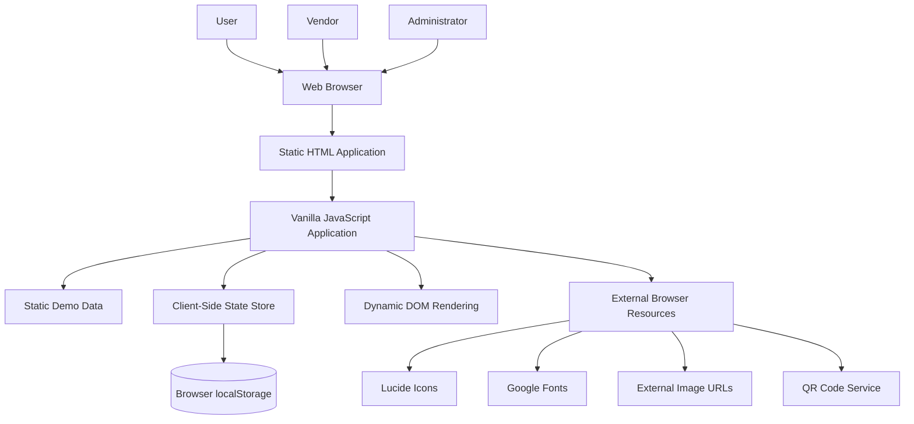

### Architecture Explanation

The user accesses Auresta through a web browser.

The browser loads:

```text
index.html
        │
        ▼
CSS Styling
        │
        ▼
data.js
        │
        ▼
state.js
        │
        ▼
app.js
```

The `data.js` module provides the initial application dataset.

The `state.js` module creates the client-side application state.

The `app.js` module renders the interface and manages application interactions.

The application dynamically renders content into:

```text
<div id="app"></div>
```

When the user performs an action, the application:

```text
User Interaction
        │
        ▼
JavaScript Event
        │
        ▼
State Update
        │
        ▼
localStorage Persistence
        │
        ▼
State Notification
        │
        ▼
Application Re-render
        │
        ▼
Updated User Interface
```

---

# 4. Frontend Architecture

The frontend is responsible for the complete current Auresta user experience.

### Main Responsibilities

The frontend currently handles:

* User interface rendering.
* Navigation.
* Role switching.
* Vendor discovery.
* Search and filtering.
* Vendor comparison.
* Package browsing.
* Custom package building.
* Booking simulation.
* Payment flow simulation.
* Event management.
* Vendor messaging simulation.
* Support messaging simulation.
* Vendor dashboard rendering.
* Vendor verification workflow simulation.
* Admin dashboard rendering.

### Role-Based Views

Auresta currently supports three primary application roles.

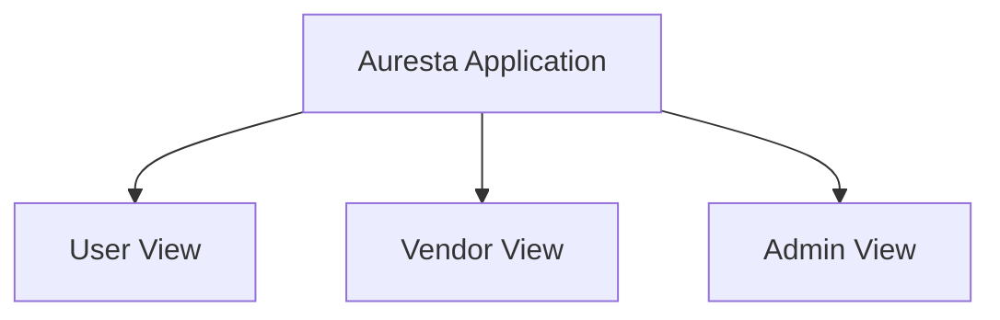

### User View

The user view includes:

```text
Home
│
├── Event Search
├── Explore Vendors
├── Packages & Deals
├── Build Package
├── Need It Now
├── My Event
└── Support
```

### Vendor View

The vendor view includes:

```text
Vendor Portal
│
├── Vendor Dashboard
├── Revenue
├── Bookings
├── Ratings
├── Profile Management
├── Verification
└── Availability Management
```

### Admin View

The admin view includes:

```text
Admin Portal
│
├── Vendor Verification
├── Platform Monitoring
├── GMV
└── Commission Monitoring
```

### Frontend Flow

```text
User
 │
 ▼
Web Browser
 │
 ▼
Auresta UI
 │
 ▼
JavaScript Event Handler
 │
 ▼
StateStore
 │
 ▼
Application State
 │
 ├── Static Data
 │
 └── Browser localStorage
 │
 ▼
State Notification
 │
 ▼
renderApp()
 │
 ▼
Updated Interface
```

---

# 5. Application State Architecture

The current Auresta application uses a centralized browser-side state manager.

The main state object contains:

```text
StateStore
│
├── currentRole
├── currentView
├── activeVendorId
├── activeModal
│
├── searchParams
│   ├── eventType
│   ├── location
│   ├── date
│   ├── guests
│   ├── budget
│   ├── urgency
│   ├── selectedCategories
│   ├── verifiedOnly
│   └── sortBy
│
├── packageFilters
│
├── favorites
│
├── events
│
├── bookings
│
├── supportTickets
│
├── vendorMessages
│
├── customPackage
│
├── checkoutDraft
│
├── vendorProfileDraft
│
└── vendorVerifications
```

### State Update Flow

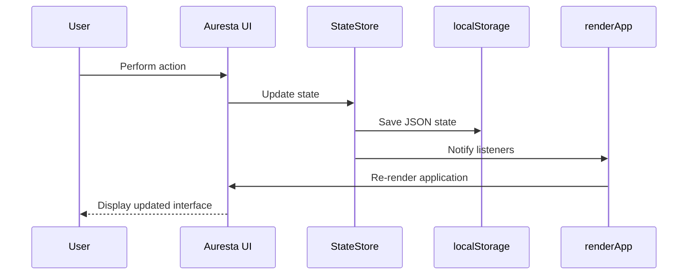

---

# 6. Vendor Discovery Architecture

The vendor discovery system allows users to search for suitable event service providers.

### Search Inputs

Users can provide:

* Event type
* Location
* Event date
* Guest count
* Budget
* Urgency
* Service categories
* Verification requirement
* Availability preference

### Vendor Discovery Flow

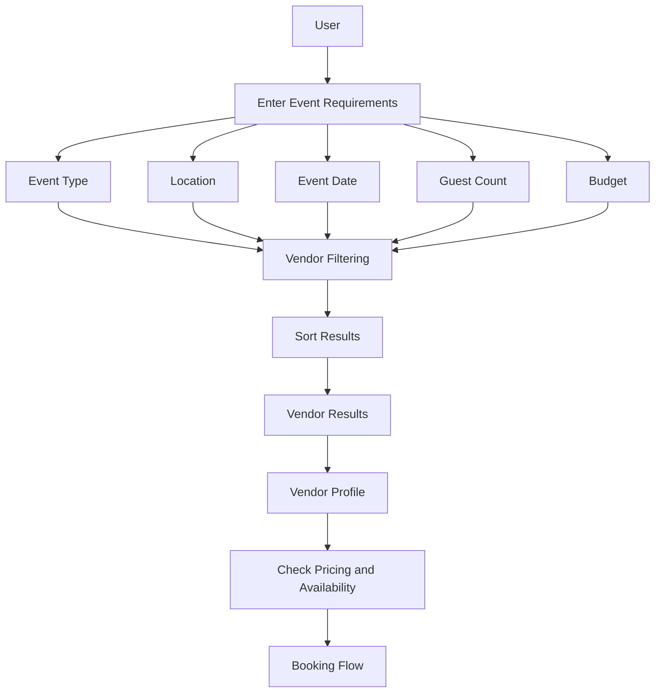

### Current Implementation

Currently, filtering and discovery operate against browser-side demo data.

A production system should replace this with database queries and server-side APIs.

---

# 7. Booking Architecture

The current booking flow is implemented in client-side JavaScript.

### Booking Workflow

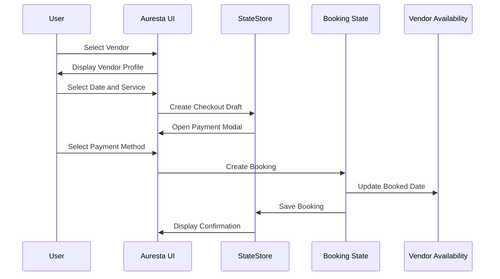

### Current Booking Behavior

The current implementation:

1. Creates a booking object in browser state.
2. Generates a booking ID.
3. Adds the booking to the local booking list.
4. Updates vendor booked dates.
5. Updates event spending.
6. Stores state in browser localStorage.
7. Displays a booking confirmation.

The current payment process is a frontend simulation.

No real payment gateway transaction is implemented.

---

# 8. Package Architecture

Auresta supports two package models.

### Premade Packages

Premade packages combine multiple event services.

Example:

```text
Wedding Package
│
├── Decoration
├── Photography
├── Catering
├── Makeup
└── Entertainment
```

### Custom Package Builder

Users can build their own package.

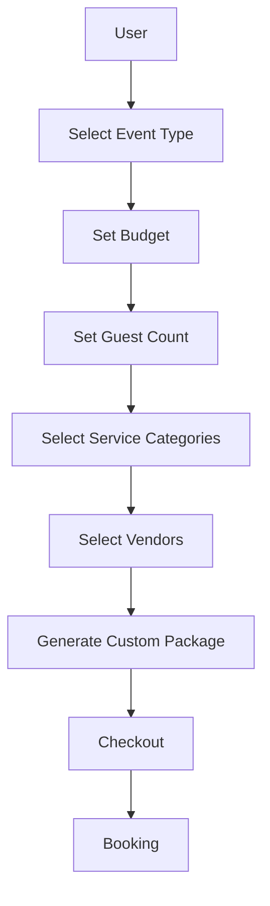

### Current Implementation

The selected vendors are stored in the browser-side application state.

A production implementation should store custom packages in a persistent database.

---

# 9. Vendor Availability Architecture

Vendor availability is an important component of Auresta.

Vendors have:

* Available dates.
* Booked dates.
* Unavailable dates.
* Booking capacity.
* Response time.
* Service radius.
* Urgent availability.

### Current Availability Flow

```text
Vendor Data
     │
     ▼
bookedDates
     │
     ▼
User Selects Date
     │
     ▼
Frontend Availability Check
     │
     ▼
Vendor Available?
     │
 ┌───┴────┐
 │        │
Yes       No
 │        │
 ▼        ▼
Booking   Display Unavailable
```

### Current Limitation

The current availability system is browser-side.

A booking performed by one browser session will not automatically update another user's browser.

A production implementation requires a centralized database and transaction-safe booking logic.

---

# 10. Messaging and Support Architecture

Auresta currently supports two communication concepts.

### Vendor Messaging

Users can communicate with vendors.

```text
Customer
    │
    ▼
Vendor Chat Interface
    │
    ▼
Client-Side Message State
    │
    ▼
Simulated Vendor Response
```

### Support Messaging

Users can communicate with Auresta support.

```text
Customer
    │
    ▼
Support Interface
    │
    ▼
Support Ticket State
    │
    ▼
Simulated Support Response
```

### Current Limitation

Messages currently exist in browser state.

A production system requires persistent conversations and real-time message delivery.

---

# 11. Vendor Verification Architecture

Auresta includes a vendor verification workflow.

### Verification Workflow

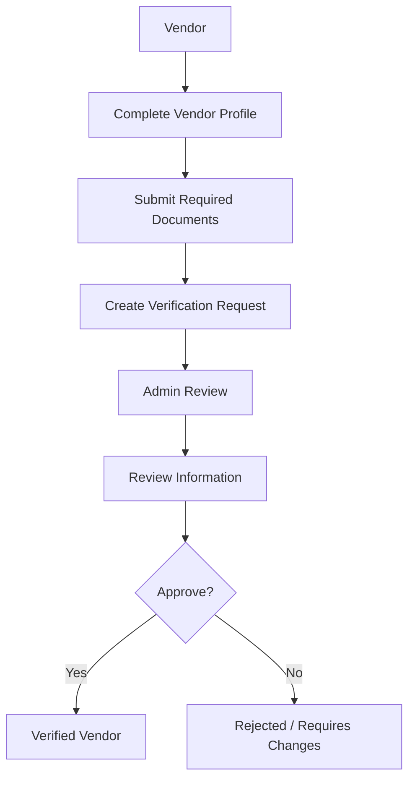

### Current Implementation

The current application stores verification status in client-side state.

Example statuses include:

* Verified
* Pending Verification

The admin view can update the verification state.

### Production Requirement

Vendor documents and verification information must be stored securely in a backend system.

---

# 12. Admin Architecture

The Admin Portal provides platform-level management.

### Main Responsibilities

Administrators should be able to:

* Review vendors.
* Verify vendor information.
* Approve vendors.
* Reject vendors.
* Monitor bookings.
* Monitor transaction volume.
* Monitor GMV.
* Monitor commission.
* Manage marketplace activity.

### Admin Data Flow

```text
Platform Data
      │
      ├── Vendors
      │
      ├── Verification Requests
      │
      ├── Bookings
      │
      ├── Payments
      │
      └── Commission Data
              │
              ▼
         Admin API
              │
              ▼
         Admin Dashboard
```

---

# 13. Current Data Architecture

The current Auresta repository does not contain a centralized database.

Data currently exists in:

```text
Static JavaScript Data
        +
Browser State
        +
localStorage
```

### Current Data Sources

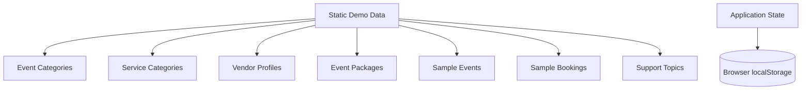

### Limitation

This architecture is suitable for:

* Demonstrations
* Prototypes
* UI testing
* Concept validation

It is not sufficient for a real multi-user marketplace because:

* Data is not globally shared.
* Users cannot securely authenticate.
* Vendors cannot securely manage accounts.
* Real bookings cannot be transactionally protected.
* Payments cannot be securely processed.
* Admin permissions cannot be enforced.
* Data can be modified from the browser.

---

# 14. Proposed Production Backend Architecture

A production Auresta platform should introduce a dedicated backend/API layer.

### Proposed Architecture

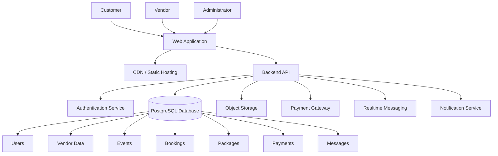

### Backend Responsibilities

The backend should handle:

* Authentication.
* Authorization.
* User management.
* Vendor management.
* Vendor verification.
* Vendor discovery.
* Search and filtering.
* Availability checks.
* Booking creation.
* Booking conflict prevention.
* Payment processing.
* Commission calculation.
* Messaging.
* Notifications.
* Support tickets.
* Admin operations.
* Reporting and analytics.

---

# 15. Proposed Authentication Architecture

A production Auresta platform requires real authentication.

### User Roles

```text
User
Vendor
Administrator
Support Staff
```

### Authentication Flow

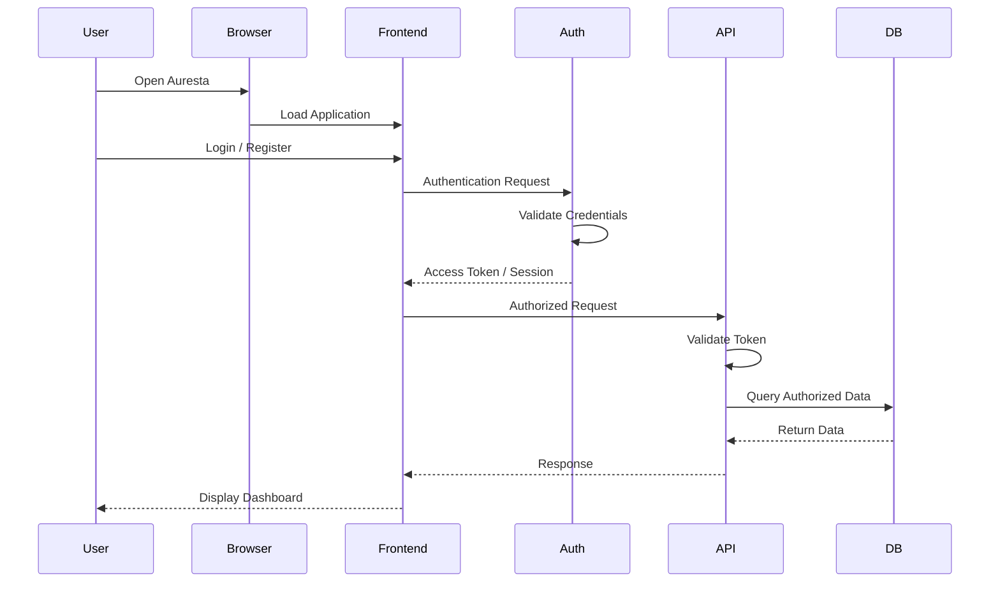

### Role-Based Authorization

Authorization should control access.

Example:

```text
Customer
    │
    ├── Browse Vendors
    ├── Create Events
    ├── Create Bookings
    └── Manage Payments

Vendor
    │
    ├── Manage Profile
    ├── Manage Services
    ├── Manage Availability
    └── View Bookings

Administrator
    │
    ├── Verify Vendors
    ├── Manage Platform
    └── View Platform Analytics
```

---

# 16. Proposed Database Architecture

A production implementation should use a relational database such as PostgreSQL.

### Core Entities

```text
Users
│
├── Events
├── Bookings
├── Favorites
├── Messages
└── Support Tickets

Vendors
│
├── Vendor Services
├── Vendor Packages
├── Vendor Availability
├── Vendor Documents
├── Ratings
└── Reviews

Packages
│
├── Package Services
└── Package Vendors

Bookings
│
├── Booking Items
├── Payments
└── Booking Status History
```

### Proposed Entity Relationship Model

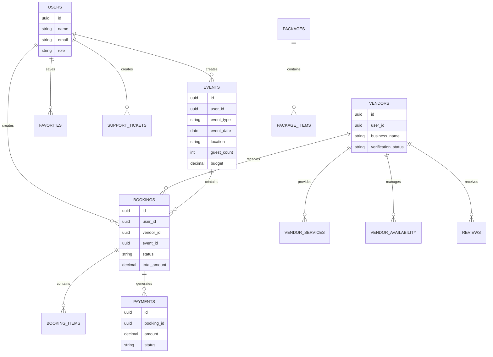

---

# 17. Proposed Booking Data Flow

A real booking must prevent scheduling conflicts.

### Production Booking Flow

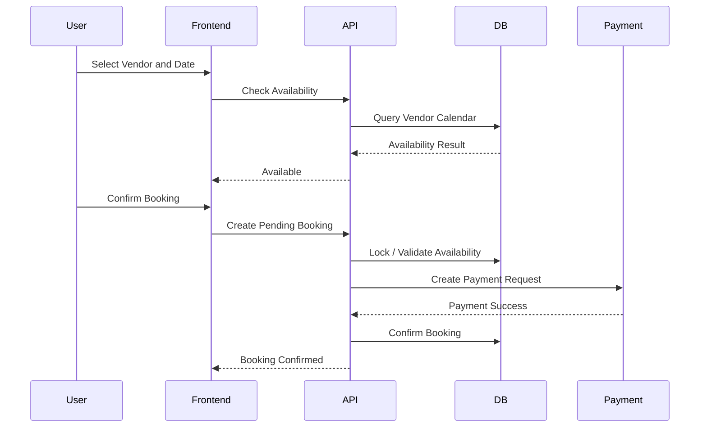

### Important Production Rule

Availability validation must occur on the server.

The frontend alone should never be trusted to guarantee availability.

---

# 18. Proposed Payment Architecture

A production system should integrate a secure payment gateway.

### Payment Flow

```text
Customer
    │
    ▼
Auresta Checkout
    │
    ▼
Backend Creates Payment Order
    │
    ▼
Payment Gateway
    │
    ├── UPI
    ├── Card
    └── Other Payment Methods
    │
    ▼
Payment Confirmation
    │
    ▼
Backend Webhook Validation
    │
    ▼
Database Payment Record
    │
    ▼
Booking Confirmation
```

### Payment Security

Sensitive payment processing should never occur directly in Auresta's frontend.

The backend should:

* Create payment orders.
* Validate payment responses.
* Validate webhooks.
* Update booking status.
* Calculate deposits.
* Calculate balances.
* Record commissions.

---

# 19. Proposed Messaging Architecture

A production messaging system should support real-time communication.

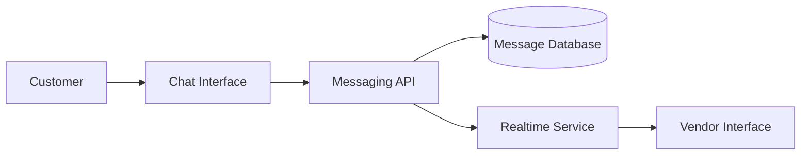

### Message Data

Messages should include:

* Conversation ID
* Sender ID
* Receiver ID
* Message content
* Timestamp
* Delivery status
* Read status

---

# 20. Proposed Storage Architecture

Object storage should be used for files.

### Stored Files

Examples include:

* Vendor portfolio images.
* Vendor verification documents.
* Profile images.
* Event images.
* Package images.

### Storage Flow

```text
Vendor
    │
    ▼
Upload File
    │
    ▼
Backend Authorization
    │
    ▼
Object Storage
    │
    ▼
File URL / Storage Reference
    │
    ▼
Database Record
    │
    ▼
Auresta Frontend
```

Private vendor verification documents should not be publicly accessible.

---

# 21. Current Deployment Architecture

The current Auresta project can be deployed as a static website.

### Current Deployment Model

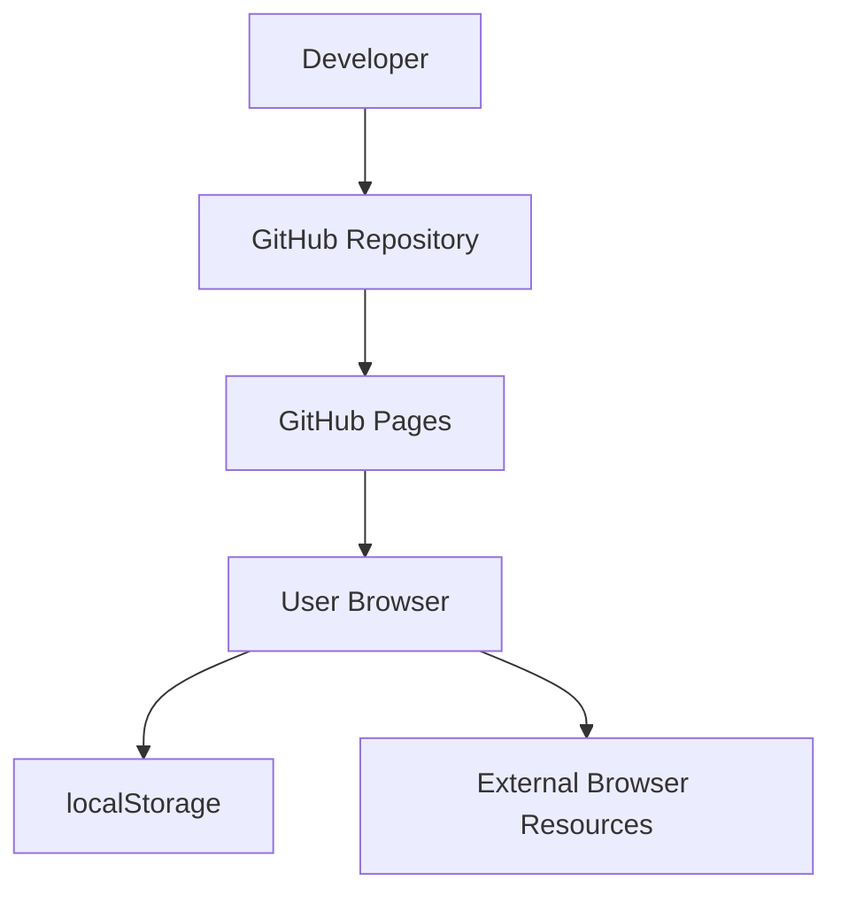

The static deployment model is appropriate for the current frontend prototype.

---

# 22. Proposed Production Cloud Architecture

A production implementation could use the following architecture.

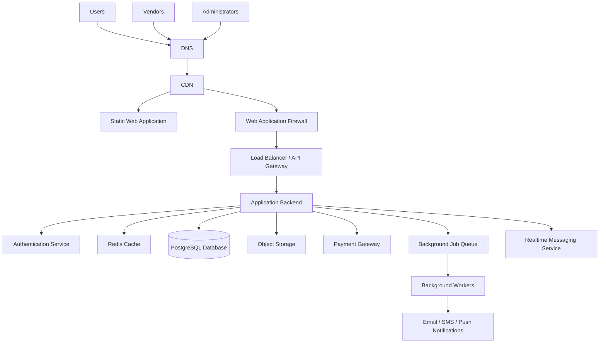

---

# 23. Scaling Architecture

As Auresta grows, the architecture should evolve.

## Early Stage

```text
Static Frontend
      +
Single Backend API
      +
PostgreSQL
      +
Object Storage
```

Suitable for:

* Early customers.
* Initial vendors.
* Prototype-to-production transition.

## Growth Stage

```text
CDN
 │
 ├── Frontend
 │
 └── API Gateway
        │
        ├── Multiple API Instances
        │
        ├── PostgreSQL
        │
        ├── Redis
        │
        ├── Object Storage
        │
        └── Background Jobs
```

## Large Marketplace Stage

Services can eventually be separated.

```text
Marketplace Platform
│
├── Identity Service
│
├── Vendor Service
│
├── Search Service
│
├── Booking Service
│
├── Payment Service
│
├── Messaging Service
│
├── Notification Service
│
├── Support Service
│
└── Analytics Service
```

Microservices should only be introduced when the platform scale and team complexity justify them.

---

# 24. Security Architecture

A production Auresta platform should implement:

* HTTPS.
* Secure authentication.
* Role-based access control.
* Server-side authorization.
* Database access policies.
* Encrypted credentials.
* Secure payment handling.
* Payment webhook verification.
* Rate limiting.
* Input validation.
* File upload validation.
* Private storage for sensitive vendor documents.
* Audit logs for administrative actions.

---

# 25. Current Architecture vs Production Architecture

| Area                | Current Auresta           | Production Auresta              |
| ------------------- | ------------------------- | ------------------------------- |
| Frontend            | Vanilla JavaScript        | Modern web frontend             |
| Data                | Static JavaScript data    | PostgreSQL database             |
| State               | Browser state             | Server-backed application state |
| Persistence         | localStorage              | Persistent cloud database       |
| Authentication      | Role switching simulation | Secure authentication           |
| Authorization       | Client-side               | Server-side RBAC                |
| Booking             | Client-side simulation    | Transaction-safe backend        |
| Payments            | UI simulation             | Real payment gateway            |
| Messaging           | Simulated                 | Real-time messaging             |
| Vendor Verification | Client-side state         | Secure document workflow        |
| Availability        | Local demo data           | Centralized calendar            |
| Deployment          | Static hosting            | CDN + frontend + backend        |
| Scaling             | Single browser session    | Horizontally scalable platform  |

---

# 26. Complete Auresta Platform Workflow

The complete Auresta workflow can be represented as:

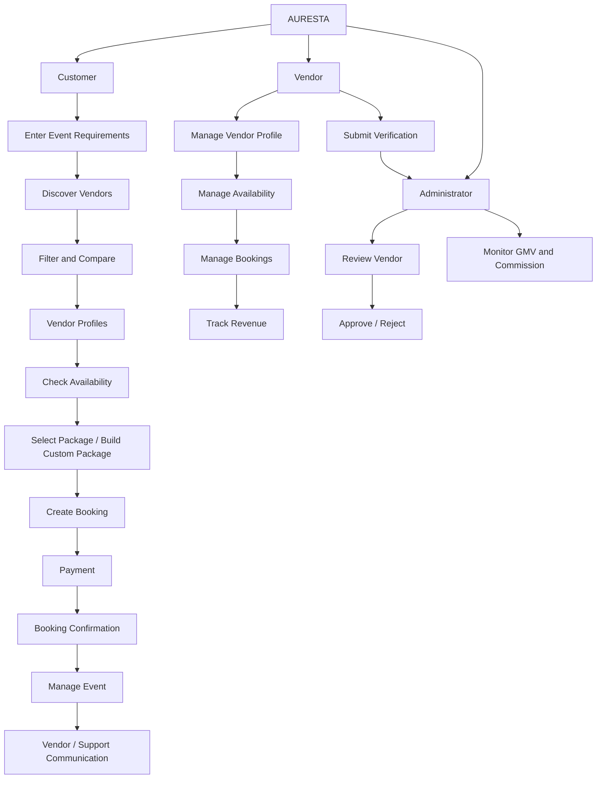

---

# 27. Recommended Future Architecture

The recommended evolution for Auresta is:

```text
CURRENT PROTOTYPE
        │
        ▼
Static Frontend
JavaScript + localStorage
        │
        ▼
MVP
        │
        ├── Authentication
        ├── PostgreSQL
        ├── Backend API
        ├── Real Vendor Accounts
        └── Persistent Bookings
        │
        ▼
MARKETPLACE PLATFORM
        │
        ├── Payment Gateway
        ├── Real-time Messaging
        ├── Notifications
        ├── Secure Verification
        ├── Centralized Availability
        └── Admin Analytics
        │
        ▼
SCALABLE PLATFORM
        │
        ├── CDN
        ├── Load Balancing
        ├── Horizontal API Scaling
        ├── Cache
        ├── Background Workers
        ├── Monitoring
        └── Advanced Analytics
```

---

# 28. Final Architecture Summary

Auresta currently operates as a sophisticated frontend prototype for an event marketplace.

The current implementation provides:

* A multi-role user experience.
* Vendor discovery.
* Event planning.
* Package discovery.
* Custom package building.
* Booking flows.
* Vendor availability.
* Support interactions.
* Vendor dashboards.
* Vendor verification workflows.
* Admin workflows.

The current architecture is centered around:

```text
Static Web Application
        │
        ▼
Vanilla JavaScript
        │
        ├── Static Demo Dataset
        │
        ├── Custom State Manager
        │
        └── Browser localStorage
```

To become a production-ready marketplace, Auresta should evolve toward:

```text
Users / Vendors / Admins
        │
        ▼
Web Application
        │
        ▼
CDN + Frontend Hosting
        │
        ▼
Backend API
        │
        ├── Authentication
        ├── Vendor Management
        ├── Booking Engine
        ├── Payment Integration
        ├── Messaging
        ├── Notifications
        └── Admin Services
                │
                ▼
        PostgreSQL Database
                +
        Object Storage
                +
        Cache
                +
        Background Workers
```

This architecture allows Auresta to evolve from its current interactive event-platform prototype into a secure, multi-user, scalable event marketplace.

